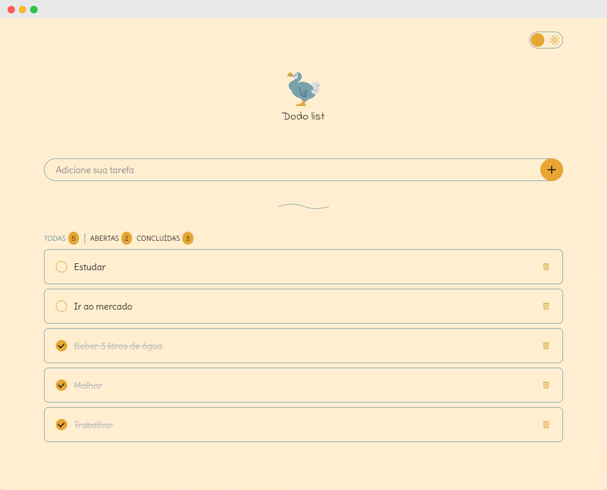

<h1 align="center" style="font-weight: bold;">Dodo list 💻</h1>

<p align="center">
  <a href="#layout">Layout</a> • 
  <a href="#tech">Technologies</a> •
  <a href="#started">Getting Started</a>
</p>

<p align="center">
    <b>Make your to-do list.</b>
</p>

<p align="center">
     <a href="https://dodo-list-sepia.vercel.app/">📱 Visit this Project</a>
</p>

<h2 id="layout">🎨 Layout</h2>

<p align="center">
    
</p>

<h2 id="tech">💻 Technologies</h2>

- Angular
- Jest

<h2 id="started">🚀 Getting started</h2>

<h3>Prerequisites</h3>

- [NodeJS](https://nodejs.org/en/download)
- [Git](https://git-scm.com/downloads)

<h3>Cloning</h3>

```bash
git clone https://github.com/luizfbn/dodo-list.git
```

<h3>Starting</h3>

```bash
cd dodo-list
npm install
npm run start
```
